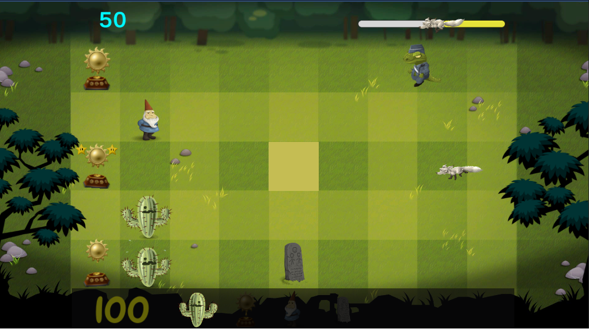

# 					Glitch Garden🧟

### 													A Plants vs Zombies clone 

### Layout do projeto concluído:

</img>

</img>

## 🚀Descrição do projeto: 

​	Glitch Garden é um jogo de tower defense onde você deve defender seu jardim de animais inconvinientes que desejam atrapalhar seus planos de ter um local onde suas plantas possam viver felizes. Te lembra algum outro jogo?

​	Ele foi realizado no curso "**Complete C# Unity Game Developer 2D**" da Udemy e ensinou várias coisas úteis como a criação de sistemas do gênero tower defense, criação de animações atráves do sistema de animação e keyframes da engine e salvamento de preferências do jogador.

***

## 🛠️ Tecnologias Utilizadas:

- Unity
- C#

***

## ⌨️ Desenvolvedor:

**Leandro Bruner**

**Contato**:

